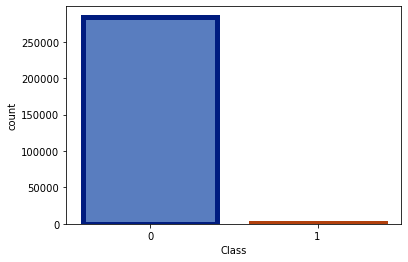
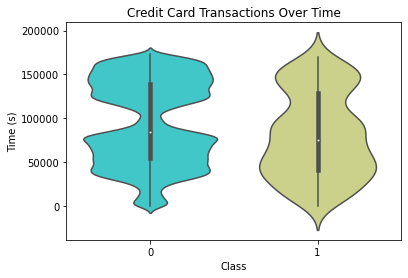
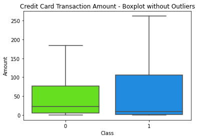
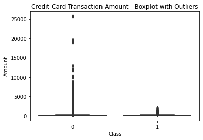
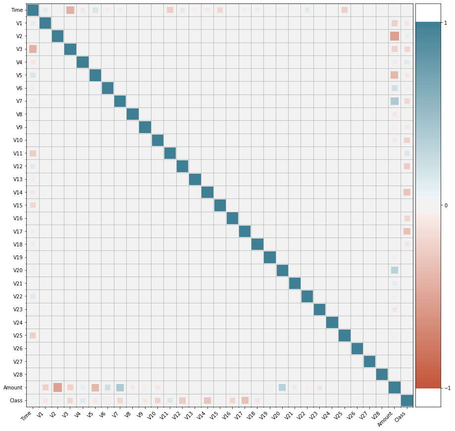
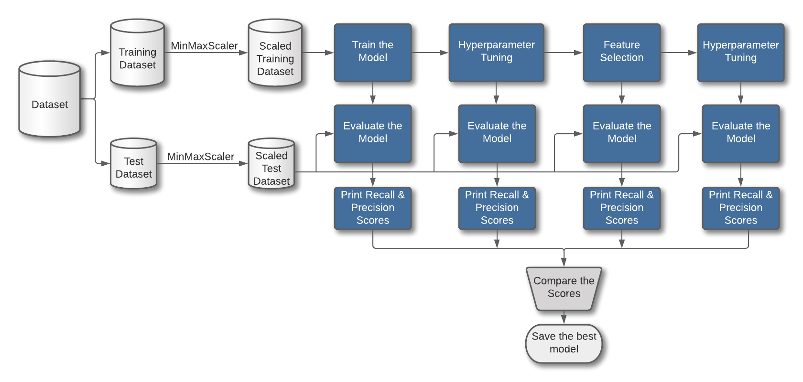

# Project title: Credit Card Fraud Detection

#### Have you ever pulled up your credit card statement to see transactions you never performed? Or Have you ever used your credit card in a store only to have it declined? One cause for these is that the bank's fraud-detecting technologies have missed to flag suspicious activity or incorrectly flagged a genuine transaction as suspicious. Our team tried various machine learning classification models on the credit card transaction data to determine the best model that would flag suspicious activity more accurately, and we are excited to share our research and predictions in the Heroku app: [https://credit-card-fraud-detection-ml.herokuapp.com/](https://credit-card-fraud-detection-ml.herokuapp.com/)

# Table of Contents

* [Project Description](#project-description)
* [Data Exploration](#data-exploration)
  * [Data](#data)
  * [Data Imbalance](#data-imbalance)
  * [Transactions Over Time](#transactions-over-time)
  * [Transaction Amount](#transaction-amount)
  * [Feature Correlation Matrix](#feature-correlation-matrix)
* [Predictive Models](#predictive-models)
  * [Process Flow](#process-flow)
  * [Predictive Models](#predictive-models)
  * [Undersampling](#undersampling)
  * [Oversampling](#oversampling)
* [Conclusion](#conclusion)
* [Future Enhancements](#future-enhancements)
* [Lessons Learned](#lessons-learned)
* [Requirements](#requirements)  
  * [Languages And Libraries](#languages-and-libraries)
* [Collaborators](#collaborators)
***

# Project Description

## Overview

Credit card fraud is the fastest-growing problem today in the financial market. There has been an accelerated increase in the rate of fraudulent activities in recent years, especially during the COVID time, causing enormous financial losses to many organizations, companies, and government agencies. The fraudulent transaction numbers are assumed to rise in the future. 

According to [The Nilson Report](https://nilsonreport.com/publication_newsletter_archive_issue.php?issue=1164), fraud losses worldwide reached $27.85 billion in 2018 and are projected to rise to $35.67 billion in five years and $40.63 billion in 10 years. Recent trends show a steep rise in credit card fraud, which can be costly to consumers, taxpayers, banks, and payment networks that issue refunds to consumers alike.  

According to [FTC reports](https://www.ftc.gov/system/files/documents/reports/consumer-sentinel-network-data-book-2019/consumer_sentinel_network_data_book_2019.pdf), Credit card fraud tops the identity theft reports from Q2 2017 until Q3 2020. Reports of credit card fraud increased by 107% from Q1 2019 to Q4 2020, Reports of credit card fraud increased by 107% from Q1 2019 to Q4 2020, increasing by only 28% from Q1 2017 to Q1 2019. This rapid spike in 2020 could be because of the new digital normal and boom in online shopping patterns in customers using credit card payments for grocery shopping and deliveries brought in by the COVID-19 pandemic.

## Objective
Our goal as researchers is to focus on detecting fraudulent behaviors early using advanced machine learning techniques. Though credit card fraud detection is not a straightforward task mainly because one being the fraudulent behaviors, which differ for each transaction attempt, and the dataset being imbalanced. 
****   
# Data Exploration

## Data
Due to the Data Privacy of sensitive payment data, which contains private information about customers and businesses, access to such data is highly restricted, making it very difficult to find a publicly available real-world data set. We were only able to find a dataset released on the [Kaggle website](https://www.kaggle.com/mlg-ulb/creditcardfraud) with 284807 transactions, a tiny sliver of data.

Data from Kaggle website was uploaded to AWS S3 Cloud Storage for further analysis and prediction models. This dataset contains credit card transactions performed in 2 days in September 2013 by European cardholders.

* There are 30 features out of which 28 features (V1, V2, ... V28) are numerical input variables resulting from a PCA transformation. The other two features, 'Amount' and 'Time,' are not PCA transformed.

* Feature 'Time' holds the seconds elapsed between each transaction and the first transaction in the dataset.

* Feature 'Class' is the target variable that takes value 1 in fraudulent transactions and 0 otherwise.

## Data Imbalance 
It is evident from the below plot that data is highly imbalanced. The dataset has only 492 fraudulent transactions out of a total of 284,807 transactions, which is a mere 0.17%.

## Transactions Over Time
It could be seen from the below plot that the number of genuine transactions during nighttime in European Timezone had been too low while the fraudulent transactions were uniformly distributed even through the nighttime.

## Transaction Amount
It is evident from the below boxplots that median and maximum transaction amount for fraudulent transactions were low compared to genuine transactions.

## Feature Correlation Matrix
We could observe from the below correlation matrix that there is no correlation between features V1-V28 and there are direct and inverse correlations between the following features:

|                     | Time        | Amount         | Class                           |
| ------------------- | ----------- | -------------- | ------------------------------- |
| Inverse Correlation | V3, V11, V25| V2, V5, V1, V3 | V17, V14, V12, V10, V7, V3, V16 |
| Direct Correlation  | V5, V22     | V7, V20        | V4, V11                         |

****
# Predictive Models

## Process Flow

Here is the process flow that we followed for most of the predictive models we used in this project.

## Predictive models

We tried various predictive models against the dataset and the table below shows the recall and precision scores for each model: 

| Model	                | Precision Score  | Recall Score   |
| --------------------- | ---------------- | -------------- |
| LogisticRegression    | 0.8375           | 0.592920354    |
| RandomForest          | 0.927083333      | 0.787610619    |
| MultinomialNaiveBayes | 0.733944954      | 0.707964602    |
| DecisionTree          | 0.881188119      | 0.787610619    |
| AdaBoost              | 0.862745098      | 0.778761062    |
| NeuralNetwork         | 0.762295         | 0.823009       |
| DeepNeuralNetwork     | 0.851485         | 0.761062       |
| SVM                   | 0.764705882      | 0.805309735    |

## Undersampling

To handle the highly imbalanced dataset, we tried undersampling methods. Undersampling methods pick small samples from the majority class, which is the genuine transactions in our case and gives us a dataset with equal number of genuine and fraudulent transactions.

We tried two different undersampling methods, the Near Miss and the Condensed nearest neighbor rule. 

#### Near Miss Undersampling Method

| Model	                 | Precision Score      | Recall Score        |
| ---------------------- | -------------------- | ------------------- |
| LogisticRegression     | 0.001727588749604972 | 1.0                 |
| RandomForest           | 0.001727485630620034 | 1.0                 |
| Multinomial NaiveBayes | 0.0017909404621500023| 1.0                 |
| Gaussian Naive Bayes   | 0.001727485630620034 | 1.0                 |
| Bernoulli Naive Bayes  | 0.018458197611292075 | 0.06910569105691057 |
| DecisionTree           | 0.0017297935849972048| 1.0                 |
| Gradient Boost         | 0.0017279103172401198| 1.0                 |
| Ada Boost              | 0.0017362152624614028| 1.0                 |
| SVM                    | 0.0017277282831226932| 1.0                 |

#### Condensed Nearest Neighbor Rule Undersampling Method
| Model	                 | Precision Score      | Recall Score        |
| ---------------------- | -------------------- | ------------------- |
| LogisticRegression     | 0.004377299668304    | 0.9817073170731707  |
| RandomForest           | 0.001775519483800189 | 1.0                 |
| Multinomial NaiveBayes | 0.0                  | 0.0                 |
| Gaussian Naive Bayes   | 0.001727485630620034 | 1.0                 |
| Bernoulli Naive Bayes  | 0.5714285714285714   | 0.016260162601626018|
| DecisionTree           | 0.002820509662401005 | 0.9308943089430894  |
| Gradient Boost         | 0.002350038188120557 | 0.975609756097561   |
| Ada Boost              | 0.0031783182839740945| 0.9715447154471545  |
| SVM                    | 0.0017326994189117801| 1.0                 |

When we evaluated the models trained with undersampled datasets against the original dataset, though the recall scores were 100% in most cases, the precision scores were almost closer to zero, meaning the models classified almost all transactions as fraudulent. So, undersampling methods did not prove to be a good option for our dataset.

## Oversampling

To handle the highly imbalanced dataset, we next tried Oversampling method. Oversampling makes new copies of the minority class, which is the fraudulent transactions in our case, and gives us a dataset with an equal number of genuine and fraudulent transactions.

#### Synthetic Minority Oversampling Technique (SMOTE)
We tried SMOTE Oversampling method on four predictive models - RandomForest, DecisionTree, AdaBoost and GradientBoosting Classifiers. The table below shows the recall and precision scores for each model trained with oversampled data using SMOTE method and evaluated against the original dataset.

| Model	                 | Precision Score      | Recall Score        |
| ---------------------- | -------------------- | ------------------- |
| RandomForest           | 0.9312977099236641   | 0.991869918699187   |
| DecisionTree           | 0.5804878048780487   | 0.967479674796748   |
| Gradient Boost         | 0.23156266116554924  | 0.9126016260162602  |
| Ada Boost              | 0.192090395480226    | 0.8983739837398373  |

We could see from the above table that the Random Forest model, trained with oversampled data using SMOTE method, had the best performance against the original dataset.

#### Random Forest with SMOTE oversampling

We could see from the below confusion matrix that only 4 fraudulent transactions were incorrectly classified as non-fraudulent and only 36 out of 284,315 genuine transactions were incorrectly classified as fraudulent.

****
# Conclusion
Fraud detection is challenging to implement in real life because it requires cooperation from banks and other companies that are unwilling to share information due to their market competition and legal requirements in protecting user data.

While we enjoyed working on this project, we could not obtain the goal of 100% in fraud detection, so we got as close as we could with a model we created to get close to our goal with enough time and data. Our project integrates multiple models and their results to increase the final result's accuracy. We trained and evaluated only four predictive models on oversampled SMOTE dataset. Again, we could try training more predictive models on oversampled SMOTE datasets and further improve their performance using Grid Search to tune the model's hyperparameters.

Machine Learning analysis faces challenges such as 1) class imbalance; many valid transactions far outnumber fraudulent ones. 2) Also, transaction patterns often change their statistical properties over time. 3) Finally, the algorithms' precision increases when the dataset's size is large. Hence, more data will make the model more accurate in detecting frauds and reducing false positives. However, this requires official support from the companies themselves and users whose data should be protected.
****
# Future Enhancements
While we could not reach out the goal of 100% accuracy in fraud detection, we created a model that can get very close to that goal with enough time and data. As with any such project, there is room for improvement. This project's very nature allows integrating multiple models and their results to increase the final result's accuracy. As part of this project, we trained and evaluated only four predictive models on oversampled SMOTE dataset. We could try training more predictive models on oversampled SMOTE datasets and further improve their performance using Grid Search to tune the model's hyperparameters. Also, the models' performance increases when the size of the dataset increases. So having more data will make the model more accurate in detecting frauds and reduce the number of false negatives.

****
# Lessons Learned

* We did not know initially that AWS S3 Cloud Server had Data Transfer monthly usage limits. While we were working on the pagination in the Data page, we accessed the data many times and ended up exceeding the monthly data transfer usage limit. We are now keeping a check on the data transfer usage and also try to limit the access.

* While we were trying to improve the model's performance using Hyperparameter tuning, a few parameters in specific models were causing the tuning process to take way too long to execute. Due to time constraints, we had to figure out which parameters were causing the delay in the Hyperparameter tuning process and eliminate them to speed up the process.

* We learned how to handle imbalanced datasets using Undersampling and Oversampling methods.

***
# Requirements
## Languages And Libraries
The following is a list of the required languages, modules, and libraries that we used.

* Jupyter Notebook
* Python
    * Pandas
    * Matplotlib
    * seaborn
    * Scikit-Learn
        * LogisticRegression
        * RandomForestClassifier
        * MultinomialNB
        * GaussianNB
        * BernoulliNB
        * DecisionTreeClassifier
        * AdaBoostClassifier
        * GradientBoostingClassifier
        * Tensorflow Keras
        * Support Vector Machine SVC
        * Near Miss Undersampling
        * CNN Undersampling
        * SMOTE Oversampling
        * GridSearchCV
* HTML
* CSS
    * Bootstrap
    * Bootswatch
* JavaScript
    * D3.js
    * Plotly.js
    * JQuery
* AWS S3 Cloud Storage

***
# Collaborators 

- - -
### Copyright

Credit Card Fraud Detection © 2021. All Rights Reserved.